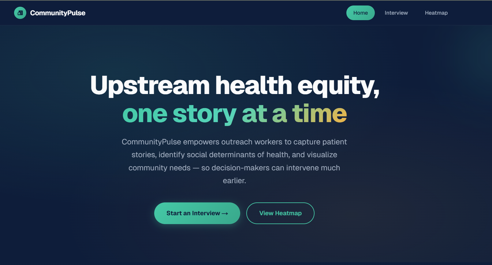

# CommunityPulse

  

CommunityPulse is a web application that helps outreach workers capture patient stories from those within the community in need. Through one-on-one interviews, it takes confidential patient information, parses and provides an in-depth analysis that helps to identiy social determinants of health. These are then plotted onto a geographical heatmap, thereby providing a visualization of community needs that can be filtered by age, gender, and other demographic factors.

## Inspiration Behind Project - Understanding the Scope of the Problem
As per the World Health Organization, many physical and mental health problems are rooted in the socioeconomic determinants of health (I.e., the conditions in which people are born, grow, live, work, age and other wider forces that shape the daily lives of others across the globe).

Some immediate determinants may include: 

* Income and income distribution;
* Quality education (I.e., literacy levels);
* Unemployment and job security;
* Employment and working conditions;
* Housing, home repairs and neighbourhood conditions;
* Access to healthy food;
* Transportation issues;

However, there are wider forces at play that can also impact a person's onset of health problems, including:

* Racism and discrimination;
* Gender inequality;
* Indigenous identity;
* Language and culture;
* Disability;
* Sexual orientation;
* Economic policies and systems etc.

According to research from WHO, the more deprived an area where people live, the higher their risk of premature death. As seen, a negative correlation exists, implicating the importance of addressing these social determinants of health to prevent the onset of health problems in the first place before issues escalate into more serious, costly, and difficult-to-treat conditions. 

While most countries have different community outreach programs to connect with at-risk individuals, we believe that the information generated from these one-on-one interviews is often underutilized. 

Knowing that WHO strongly encourages for action from both national and local political leaders to help address economic inequality, and ensure that everyone has the opportunity to attain their full health potential, we hope to help improve these processes by leveraging the information generated from these interviews to help identify and address the root causes of health problems in the first place.  

Thus, we built CommunityPulse.

## What is CommunityPulse?

CommunityPulse is a web application that helps outreach workers capture patient stories from those within the community in need. Through one-on-one interviews, it takes confidential patient information, parses and provides an in-depth analysis that helps to identiy social determinants of health. These are then plotted onto a geographical heatmap, thereby providing a visualization of high-risk areas that are in need of community services, which can be filtered by factors such as age, gender, and other demographic factors.

In this current version of CommunityPulse, we wanted to put our focus in the SDOH governing the Greater Vancouver area, as it is the home for many of our team members. As citizens of Vancouver, we have often bore witness to the growing issues of homelessness, poverty, a continually worsening housing crisis, and lack of access to healthcare in our community. Thus, we wanted to push our efforts to a city that we wish to see improve from our outreach efforts with this project. 

### Key Features 

**Geographical Location Recording:**
To keep geographical information for each incident confidential, we decided to utilize a pinned location system, giving an approximate proximity of the incident. We did this to ensure that outreach workers can identify a particular district of incidents without revealing exact coordinates.

**Interview Recording using the Web Speech API:**
For the interview intake, we emphasized on the importance of maintaining patient confidentiality. As such, we decided to attain broader patient information (I.e., age rackets rather than a designated numerical value; gender selection). 

We also utilized the Web Speech API to allow outreach workers to record interviews in real-time, without the need for a third-party application, thereby preserving the privacy of our users in need. 

**Interview Transcript Anonymization & Analysis:**
Finally, we also made use of a local LLM - Ollama - to process, anonymize and analyze interview transcriptions. Ollama can smartly parse out key information from the interview transcriptions, such as the patient's age, gender, and the social determinants of health that are affecting them - all while maintaining patient anonymity, which is something our team greatly values, especially in the advent of Artificial Intelligence.

All finalized results will then be stored in a local instance of DynamoDB.
<!-- TODO: Please correct this if not accurate -->

**Geographical Heatmap:**
<!-- TODO -->
Placeholder for now.

## Tech Stack 
CommunityPulse was built with the following technologies:

* Next.js (A front-end framework for building web applications)
* TypeScript (Programming language utilized for the Next.js framework)
* Tailwind CSS (A CSS framework for building and customizing component designs)
* Ollama (The local LLM used to process, anonymize and analyze interview transcriptions)
* Leaflet (A JavaScript library for interactive maps)
* Web Speech API (A JavaScript API for speech recognition and synthesis)
* AWS Services (DynamoDB)

## Future Plans 
* Multi-language expansion functionalities: We understand that many global communities speak different languages. Even for a city that is characterized by vast multiculturalism such as Vancouver, we hope to eventually expand our web application to support multiple languages to better serve the needs of our diverse communities. However, scalability is a challenge that we must address - we'll first streamline service delivery for those within the Greater Vancouver area before expanding to other regions (I.e., Calgary, Toronto - and one day, potentially the entirety of Canada).

* Integration with predictive analytics: As mentioned, the business model we wish to utilize for CommunityPulse is a "freemium" SaaS. For community-based organizations, such as non-profits and government agencies, we aim to provide a free tier of basic functionalities. However, for larger organizations, we hope to offer a premium tier that includes advanced features such as predictive analytics, which can be used to accurately predict and forecast potential healthcare crises' before they emerge and escalate as an enhaced preventative measure. 

* Partnerships with government agencies: CommunityPulse is a tool that we believe can be of great use to government agencies in their efforts to address social determinants of health. By providing our local government with the tools and resources required to address growing community demands and needs, we believe that this step will be able to improve our target demographic: those who are most vulnerable. 

## Instructions to Locally Run This Project

For full setup instructions (prerequisites, local backend services, and troubleshooting), see the [Developer Instructions](docs/developer-instruction.md).

## References & Resources

### Canadian Data
<ol>
<li>https://www.canada.ca/en/public-health/services/health-promotion/population-health/what-determines-health.html</li>
</ol>

### Vancouver-based Data 
<ol>
<li>https://opentextbc.ca/peersupport/part/social-determinants-of-health/</li
<li>https://vancouver.ca/people-programs/research-and-data-toward-a-healthy-city-for-all.aspx (See: City of Vancouver Overall)</li>
<li>https://communityhealth.phsa.ca/HealthProfiles/HealthReportFactorsThatAffectHealth/Vancouver%20-%20Aggregate</li>
<li>https://pmc.ncbi.nlm.nih.gov/articles/PMC4910448/</li>
</ol>

### The Problem Scope
<ol>
<li>https://www.ncbi.nlm.nih.gov/books/NBK573923/</li>
<li>https://www.who.int/news-room/fact-sheets/detail/social-determinants-of-health</li>
</ol>

